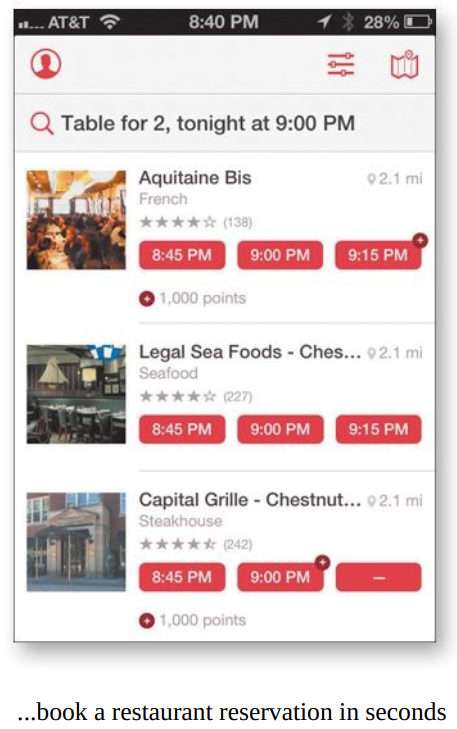
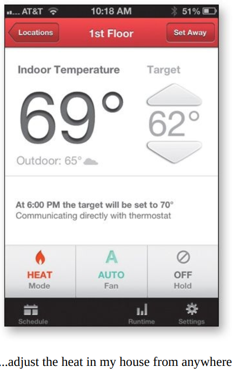
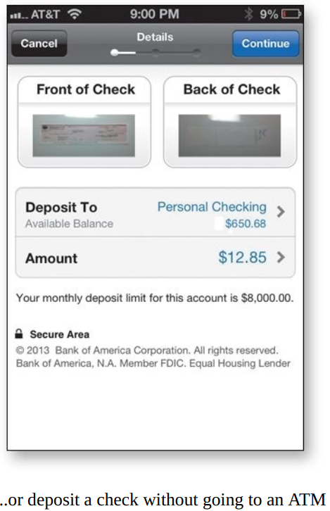
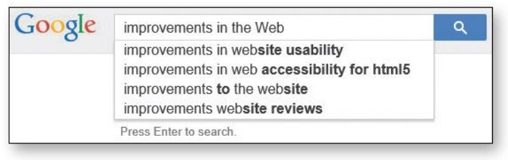

# ĐỪNG BẮT TÔI PHẢI SUY NGHĨ, TÁI BẢN
**Cách Tiếp Cận Thông Thường Về Tính Khả Dụng Web**
**Tác giả:** Steve Krug

**Bản quyền © 2014 Steve Krug**
New Riders
www.newriders.com

**Ấn bản Thứ nhất**
Dành tặng cha tôi, người luôn muốn tôi viết một cuốn sách,
Mẹ tôi, người luôn khiến tôi cảm thấy mình có thể làm được,
Melanie, người đã kết hôn với tôi—may mắn lớn nhất trong cuộc đời tôi,
và con trai tôi, Harry, người chắc chắn sẽ viết những cuốn sách tuyệt vời hơn cuốn này bất cứ khi nào nó muốn.

**Ấn bản Thứ hai**
Dành tặng người anh trai cả Phil của tôi, người đã sống một cuộc đời trọn vẹn nhân cách.

**Ấn bản Thứ ba**
Dành tặng tất cả mọi người—từ khắp nơi trên thế giới—những người đã rất tử tế với cuốn sách này trong suốt mười bốn năm qua. Những lời khen ngợi của các bạn—trực tiếp, qua email, và trên các blog của các bạn—là một trong những niềm vui lớn nhất trong cuộc đời tôi.
Đặc biệt là người phụ nữ đã nói rằng cuốn sách khiến cô ấy cười sặc sụa đến mức sữa phun ra cả mũi.

---

# MỤC LỤC
**LỜI TỰA** Về ấn bản này
**GIỚI THIỆU** Đọc tôi trước
*Phần mở đầu và tuyên bố miễn trừ*

**CÁC NGUYÊN TẮC ĐỊNH HƯỚNG**
CHƯƠNG 1 Đừng bắt tôi phải nghĩ!
*Định luật Khả dụng Đầu tiên của Krug*
CHƯƠNG 2 Cách chúng ta thực sự sử dụng Web
*Quét, chọn phương án đủ tốt, và lần mò vượt qua*
CHƯƠNG 3 Thiết kế Biển quảng cáo 101
*Thiết kế để quét, không phải để đọc*
CHƯƠNG 4 Động vật, Thực vật, hay Khoáng sản?
*Tại sao người dùng thích những lựa chọn không cần động não*
CHƯƠNG 5 Lược bỏ những từ thừa
*Nghệ thuật của việc không viết cho Web*

**NHỮNG THỨ BẠN CẦN LÀM CHO ĐÚNG**
CHƯƠNG 6 Biển chỉ đường và Vụn bánh mì
*Thiết kế hệ thống điều hướng*
CHƯƠNG 7 Lý thuyết Big Bang trong Thiết kế Web
*Tầm quan trọng của việc giúp người dùng bắt đầu đúng hướng*

**ĐẢM BẢO BẠN ĐÃ LÀM ĐÚNG**
CHƯƠNG 8 "Nông dân và Cao bồi nên làm bạn"
*Tại sao hầu hết các cuộc tranh luận về tính khả dụng đều lãng phí thời gian, và cách tránh chúng*
CHƯƠNG 9 Kiểm tra tính khả dụng với 10 xu mỗi ngày
*Giữ mọi thứ đơn giản—để bạn thực hiện đủ thường xuyên*

**CÁC VẤN ĐỀ LỚN HƠN VÀ ẢNH HƯỞNG BÊN NGOÀI**
CHƯƠNG 10 Di động: Nó không chỉ còn là một thành phố ở Alabama nữa
*Chào mừng đến với Thế kỷ 21. Bạn có thể sẽ trải qua một chút cảm giác chóng mặt*
CHƯƠNG 11 Tính khả dụng như một phép lịch sự thông thường
*Tại sao trang web của bạn nên là một "người tử tế"*
CHƯƠNG 12 Khả năng truy cập và bạn
*Ngay khi bạn nghĩ mình đã xong, một con mèo trôi qua với miếng bánh mì nướng bơ buộc trên lưng*
CHƯƠNG 13 Hướng dẫn cho những người bối rối
*Thúc đẩy tính khả dụng xảy ra ở nơi bạn làm việc*

---

# LỜI TỰA: VỀ ẤN BẢN NÀY

*"Mọi người đến và đi thật nhanh ở đây!"*
—DOROTHY GALE (JUDY GARLAND) TRONG PHÙ THỦY XỨ OZ (1939)

Tôi đã viết ấn bản đầu tiên của *Đừng Bắt Tôi Phải Suy Nghĩ* vào năm 2000.
Đến năm 2002, tôi bắt đầu nhận được vài email mỗi năm từ độc giả hỏi (rất lịch sự) liệu tôi có nghĩ đến việc cập nhật nó không. Không phải phàn nàn; chỉ là họ đang cố giúp đỡ. "Rất nhiều ví dụ đã lỗi thời" là nhận xét thường thấy.

Phản hồi tiêu chuẩn của tôi là chỉ ra rằng vì tôi viết nó ngay vào thời điểm bong bóng Internet vỡ ra, nhiều trang web tôi dùng làm ví dụ đã biến mất trước khi sách được xuất bản. Nhưng tôi không nghĩ điều đó làm cho các ví dụ trở nên kém rõ ràng.

Cuối cùng, vào năm 2006, tôi có một động lực cá nhân mạnh mẽ để cập nhật nó. Nhưng khi tôi đọc lại để xem mình nên thay đổi gì, tôi cứ nghĩ "Tất cả những điều này vẫn đúng." Tôi thực sự không tìm thấy nhiều thứ cần phải thay đổi.

Nếu đó là một ấn bản mới, thì phải có gì đó khác biệt. Vì vậy, tôi đã thêm ba chương mà tôi không có thời gian hoàn thành vào năm 2000, bấm nút báo thức, và vui vẻ kéo chăn trùm qua đầu thêm bảy năm nữa.

Vậy tại sao bây giờ, cuối cùng, lại có một ấn bản mới? Hai lý do.

**#1. Đối mặt với nó: Nó đã cũ**
Không còn nghi ngờ gì nữa: Nó có cảm giác lỗi thời. Xét cho cùng, nó đã 13 năm tuổi, tương đương với một trăm năm trong "thời gian Internet". 
Hầu hết các trang Web tôi dùng làm ví dụ, như trang web tranh cử của Thượng nghị sĩ Orrin Hatch năm 2000, bây giờ trông thực sự cũ kỹ.
Các trang web ngày nay có xu hướng trông phức tạp và tinh vi hơn nhiều, như bạn mong đợi.

Gần đây tôi bắt đầu lo lắng rằng cuốn sách cuối cùng sẽ đạt đến điểm mà nó trông quá lỗi thời đến mức nó sẽ ngừng phát huy hiệu quả. Tôi biết điều đó chưa xảy ra vì nó vẫn bán chạy đều đặn. Nó thậm chí đã trở thành tài liệu đọc bắt buộc trong rất nhiều khóa học.
Những độc giả mới từ khắp nơi trên thế giới tiếp tục tweet về những điều họ đã học được từ nó.
Tôi vẫn tiếp tục nghe câu chuyện này: "Tôi đã đưa nó cho sếp của tôi, hy vọng ông ấy cuối cùng sẽ hiểu tôi đang nói về điều gì. Ông ấy thực sự đã đọc nó, và sau đó ông ấy đã mua nó cho toàn bộ đội ngũ/phòng ban/công ty của chúng tôi!"
Mọi người liên tục nói với tôi rằng họ đã có được công việc nhờ đọc nó hoặc nó đã ảnh hưởng đến lựa chọn nghề nghiệp của họ.

Nhưng tôi biết rằng cuối cùng hiệu ứng lão hóa sẽ khiến mọi người không đọc nó nữa, giống như lý do khiến tôi rất khó bảo con trai mình xem những bộ phim đen trắng khi nó còn nhỏ, bất kể chúng hay đến đâu.
Rõ ràng, đã đến lúc cần có những ví dụ mới.

**#2. Thế giới đã thay đổi**
Nói rằng máy tính, Internet và cách chúng ta sử dụng chúng đã thay đổi rất nhiều gần đây là nói giảm nói tránh. 
Bối cảnh đã thay đổi theo ba cách:
* **Công nghệ đã dùng "steroid".** Năm 2000, chúng ta sử dụng Web trên các màn hình tương đối lớn, với chuột hoặc bàn di chuột và bàn phím. Bây giờ chúng ta sử dụng những chiếc máy tính tí hon mà chúng ta mang theo bên mình mọi lúc, với camera, bản đồ thần kỳ, và toàn bộ thư viện sách và nhạc tích hợp sẵn.

* **Bản thân Web tiếp tục cải thiện.** Ngay cả khi tôi sử dụng máy tính để bàn để làm tất cả những việc tôi luôn làm trên Web, các trang web tôi sử dụng có xu hướng mạnh mẽ và hữu ích hơn nhiều so với các tiền thân của chúng. Chúng ta đã quen với những thứ như tự động gợi ý và tự động sửa lỗi.

* **Tính khả dụng đã trở thành xu hướng chủ đạo.** Năm 2000, không có nhiều người hiểu tầm quan trọng của tính khả dụng. Bây giờ, nhờ một phần lớn vào Steve Jobs (và Jonathan Ive), hầu như mọi người đều hiểu rằng nó quan trọng. Ngoại trừ việc bây giờ họ thường gọi nó là Thiết kế Trải nghiệm Người dùng (UXD hoặc UX).

Đừng hiểu lầm tôi...
Ấn bản này có các ví dụ mới, một số nguyên tắc mới, và một vài điều tôi đã học được trên chặng đường, nhưng nó vẫn là cùng một cuốn sách, với cùng một mục đích: Nó vẫn là một cuốn sách về việc thiết kế các trang Web tuyệt vời, dễ sử dụng.
Và nó cũng vẫn là một cuốn sách về việc thiết kế bất cứ thứ gì mà con người cần tương tác, cho dù đó là lò vi sóng, ứng dụng di động hay máy ATM.
Các nguyên tắc cơ bản vẫn giống nhau ngay cả khi bối cảnh đã thay đổi, bởi vì tính khả dụng là về con người và cách họ hiểu và sử dụng mọi thứ, không phải về công nghệ. Và trong khi công nghệ thường thay đổi nhanh chóng, con người thay đổi rất chậm.

---

# GIỚI THIỆU: ĐỌC TÔI TRƯỚC

**LỜI MỞ ĐẦU VÀ TUYÊN BỐ MIỄN TRỪ**
*"Tôi không thể nói cho bạn bất cứ điều gì mà bạn chưa biết. Nhưng tôi muốn làm rõ vài điều."*
—JOE FERRARA, MỘT NGƯỜI BẠN HỌC CẤP 3 CỦA TÔI

Tôi có một công việc tuyệt vời. Tôi là một chuyên gia tư vấn về tính khả dụng. Đây là những gì tôi làm: 
* Mọi người ("khách hàng") gửi cho tôi thứ gì đó họ đang làm. 
* Tôi cố gắng sử dụng những gì họ gửi cho tôi, làm những việc mà người dùng của họ cần hoặc muốn làm. Tôi ghi chú những nơi mọi người có khả năng bị mắc kẹt.
* Đôi khi tôi nhờ người khác thử sử dụng nó trong khi tôi quan sát ("kiểm tra tính khả dụng").
* Tôi có một cuộc họp với nhóm của khách hàng để mô tả các vấn đề tôi tìm thấy và giúp họ quyết định vấn đề nào quan trọng nhất cần sửa.
* Họ trả tiền cho tôi.

**Tin xấu: Bạn có thể không có một chuyên gia về tính khả dụng**
Hầu hết mọi nhóm phát triển đều có thể sử dụng ai đó như tôi. Nhưng đáng tiếc, đại đa số họ không đủ tiền để thuê một chuyên gia. Và ngay cả khi họ có thể, cũng không có đủ người để phân bổ.
Trong những năm gần đây, việc làm cho mọi thứ trở nên dễ sử dụng đã trở thành trách nhiệm của hầu hết mọi người. Các nhà thiết kế hình ảnh và lập trình viên bây giờ thường thấy mình phải làm những việc như thiết kế tương tác và kiến trúc thông tin.
Tôi viết cuốn sách này chủ yếu dành cho những người không đủ khả năng thuê ai đó như tôi.

**Tin tốt: Nó không phải là "phẫu thuật tên lửa"**
May mắn thay, phần lớn những gì tôi làm chỉ là lẽ thường, và bất kỳ ai có chút quan tâm đều có thể học cách làm nó.
Tôi dành rất nhiều thời gian để nói với mọi người những điều họ đã biết, vì vậy đừng ngạc nhiên nếu bạn thấy mình nghĩ "Tôi biết rồi" rất nhiều trong các trang tiếp theo.

**Nó là một cuốn sách mỏng**
Tôi đã làm việc chăm chỉ để giữ cho cuốn sách này ngắn gọn. Tôi viết cho những người đang ở trong "chiến hào"—các nhà thiết kế, lập trình viên, quản lý dự án—và cho những người "một mình làm tất cả".
Bạn không cần phải biết mọi thứ. Tôi thấy rằng những đóng góp có giá trị nhất mà tôi mang lại cho mỗi dự án luôn đến từ việc ghi nhớ chỉ một vài nguyên tắc khả dụng chính.

**Không có mặt trong ảnh**
Để bạn không lãng phí thời gian tìm kiếm chúng, đây là một vài thứ bạn sẽ không tìm thấy trong cuốn sách này:
* **Các quy tắc khả dụng cứng nhắc và nhanh chóng.** Câu trả lời thực sự cho hầu hết các câu hỏi là "Nó còn tùy thuộc".
* **Những dự đoán về tương lai của công nghệ.** Đoán già đoán non thôi.
* **Sự chê bai các trang web được thiết kế kém.** Thiết kế, xây dựng và duy trì một trang web tuyệt vời không hề dễ dàng. Bất kỳ ai làm được dù chỉ một nửa đã đáng nhận được sự ngưỡng mộ của tôi.

**Bây giờ đã có thêm Di động!**
Một trong những tình thế tiến thoái lưỡng nan tôi phải đối mặt khi cập nhật cuốn sách này là nó luôn là một cuốn sách về thiết kế các trang Web dễ sử dụng. Nhưng bây giờ có rất nhiều người thiết kế ứng dụng di động. Vì vậy, tôi đã làm ba việc:
* Bao gồm các ví dụ về di động ở bất cứ nơi nào hợp lý.
* Thêm một chương mới về một số vấn đề khả dụng đặc thù của di động.
* Và quan trọng nhất: Thêm "và Di động" vào phụ đề trên bìa.

**Một điều cuối cùng, trước khi chúng ta bắt đầu**
Định nghĩa của tôi về tính khả dụng. Bạn sẽ tìm thấy rất nhiều định nghĩa khác nhau. Nhưng với tôi, phần quan trọng của định nghĩa khá đơn giản. Nếu một thứ gì đó có thể sử dụng được—cho dù đó là trang Web, điều khiển từ xa hay cửa xoay—nó có nghĩa là:
*Một người có năng lực và kinh nghiệm trung bình (hoặc thậm chí dưới trung bình) có thể tìm ra cách sử dụng thứ đó để hoàn thành điều gì đó mà không gặp rắc rối quá mức đáng giá.*

---

# CÁC NGUYÊN TẮC ĐỊNH HƯỚNG

## CHƯƠNG 1. Đừng bắt tôi phải nghĩ!
**ĐỊNH LUẬT KHẢ DỤNG ĐẦU TIÊN CỦA KRUG**

*"Michael, sao rèm cửa lại mở?"*
—KAY CORLEONE TRONG BỐ GIÀ, PHẦN II

Mọi người thường hỏi tôi:
"Điều quan trọng nhất tôi nên làm nếu muốn đảm bảo trang web hoặc ứng dụng của mình dễ sử dụng là gì?"
Câu trả lời rất đơn giản. Nó không phải là "Không có gì quan trọng được cách xa quá hai cú nhấp chuột" hay "Hãy nói ngôn ngữ của người dùng" hay "Hãy nhất quán."
Mà là...
**"Đừng bắt tôi phải suy nghĩ!"**

Đây là định luật khả dụng đầu tiên của tôi.
Nó là nguyên tắc bao trùm—trọng tài tối cao khi quyết định xem một thiết kế có hoạt động hay không. Nếu bạn chỉ có chỗ trong đầu cho một quy tắc khả dụng, hãy biến nó thành quy tắc này.
Khi tôi nhìn vào một trang Web, nó phải tự hiển nhiên. Rõ ràng. Tự giải thích.
Tôi phải có thể "hiểu ra nó"—nó là gì và cách sử dụng nó—mà không cần tốn chút công sức suy nghĩ nào.

**Những thứ khiến chúng ta phải suy nghĩ**
Tất cả các loại thứ trên một trang Web có thể khiến chúng ta dừng lại và suy nghĩ không cần thiết. Hãy lấy tên gọi làm ví dụ. Những thủ phạm điển hình là những cái tên dễ thương, thông minh, do marketing tạo ra, hoặc tên kỹ thuật xa lạ.
Khi bạn tạo một trang web, công việc của bạn là loại bỏ các dấu hỏi.
Khi tôi nhìn vào một trang không khiến tôi phải suy nghĩ, tất cả các bong bóng suy nghĩ trên đầu tôi nói những điều như "OK, kia là_____. Và đó là một_____. Và kia là thứ tôi muốn."
Nhưng khi tôi nhìn vào một trang khiến tôi phải suy nghĩ, tất cả các bong bóng suy nghĩ đều có dấu hỏi chấm.

Một nguồn tạo ra dấu hỏi không cần thiết khác là các liên kết và nút không rõ ràng là có thể nhấp được. Là một người dùng, tôi không bao giờ phải dành một mili giây suy nghĩ xem mọi thứ có thể nhấp được hay không.
Mỗi dấu hỏi chấm đều cộng thêm vào gánh nặng nhận thức của chúng ta, làm phân tán sự chú ý của chúng ta khỏi nhiệm vụ trước mắt.

**Bạn không thể biến mọi thứ trở nên hiển nhiên**
Mục tiêu của bạn nên là mỗi trang hoặc màn hình trở nên hiển nhiên, để chỉ bằng cách nhìn vào nó, người dùng trung bình sẽ biết nó là gì và cách sử dụng nó.
Đôi khi, đặc biệt là nếu bạn đang làm điều gì đó mang tính đột phá hoặc vốn dĩ phức tạp, bạn phải chấp nhận sự *tự giải thích*. Trên một trang tự giải thích, cần một chút suy nghĩ để "hiểu ra nó"—nhưng chỉ một chút thôi.
Đây là quy tắc: Nếu bạn không thể làm cho thứ gì đó hiển nhiên, bạn ít nhất cần làm cho nó tự giải thích.

**Tại sao tất cả những điều này lại quan trọng?**
Lý do chính không phải là vì có quá nhiều sự cạnh tranh. 
Làm cho mỗi trang hoặc màn hình trở nên hiển nhiên giống như việc có ánh sáng tốt trong một cửa hàng: nó chỉ làm cho mọi thứ trông đẹp hơn. Sử dụng một trang web không khiến chúng ta phải suy nghĩ về những điều không quan trọng mang lại cảm giác nhẹ nhàng, trong khi việc phải đau đầu giải mã những thứ không quan trọng sẽ rút cạn năng lượng và sự nhiệt tình của chúng ta.
Nhưng như bạn sẽ thấy ở chương tiếp theo khi chúng ta kiểm tra cách chúng ta thực sự sử dụng Web, lý do chính khiến việc không bắt tôi phải suy nghĩ trở nên quan trọng là vì hầu hết mọi người sẽ dành ít thời gian hơn nhiều để nhìn vào các trang chúng ta thiết kế so với những gì chúng ta tưởng tượng.
Do đó, nếu các trang Web có hiệu quả, chúng phải phát huy tác dụng chỉ trong một cái liếc nhìn.